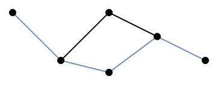
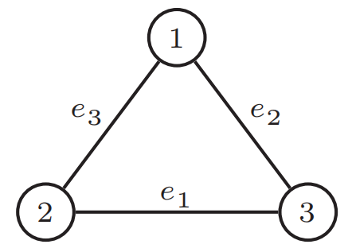

# 松弛与界限

# 最优性与松弛

&emsp;&emsp;我们需要考虑一个点$\boldsymbol{x}$是不是最优的。换句话说，我们需要找到一些最优性条件，这些条件可以为IP算法提供寻找最优解的终止准则。一个朴素但重要的想法是，算法可以找到一个递减序列和一个递增序列，去逼近最优值。那么，当迭代足够多次，这两个序列的会足够近，即可作为终止条件：$\overline{Z}_s-\underline{Z}_t<\epsilon$。因此，我们需要找到一个能找到这样的序列的算法。

&emsp;&emsp;下界很显然，可行域中每个$\boldsymbol{x}$都是最大化问题的一个下界。然而，有的问题找到一个可行解也并不简单。对于最大化问题的上界是相对具有挑战性的，这些被称为**对偶界**(dual bounds)。一个找上界最重要的方法是通过**松弛**(relaxation)，此方法有两种可能性：

- 扩大可行解的集合，以便在更大的集合上进行优化。
- 把目标函数替换为在所有原始可行解上具有相同或更大的函数。

!!! note "Definition 2.1 (relaxation)"

    &emsp;&emsp;一个优化问题$\max\{f(\boldsymbol{x}):\boldsymbol{x}\in \boldsymbol{T}\subseteq\mathbb{R}^n\}$是原问题$Z=\max\{\boldsymbol{c}(\boldsymbol{x}):\boldsymbol{x}\in\boldsymbol{X}\subseteq\mathbb{R}^n\}$的松弛问题，是当满足以下条件：

    - $\boldsymbol{X}\subseteq\boldsymbol{T}$
    - $f(\boldsymbol{x})\geq\boldsymbol{c}(\boldsymbol{x})$对任意$\boldsymbol{x}\in\boldsymbol{X}$成立。

!!! tip "Proposition 2.1"

    &emsp;&emsp;如果$\mathrm{RP}$是一个$\mathrm{IP}$的松弛问题，则$Z^{\mathrm{RP}}\geq Z$。

!!! quote "Proof"

    &emsp;&emsp;如果$\boldsymbol{x}^*$是$\mathrm{IP}$的一个最优解，那么$\boldsymbol{x}^*\in\boldsymbol{X}\subseteq\boldsymbol{T}$且$Z=\boldsymbol{c}(\boldsymbol{x}^*)\leq f(\boldsymbol{x}^*)$。

	&emsp;&emsp;当$\boldsymbol{x}^*\in T$，$f(\boldsymbol{x}^*)$是$Z^{\mathrm{RP}}$的一个下界，所以$Z\leq f(\boldsymbol{x}^*)\leq Z^{\mathrm{RP}}$。

&emsp;&emsp;那么，最后的问题是如何构建合适的松弛，一个最简单的方案就是线性规划松弛。

# 线性规划松弛

!!! note "Definition 2.2 (linear programming relaxation)"

    &emsp;&emsp;对于整数规划$\max\{\boldsymbol{c}\boldsymbol{x}:\boldsymbol{x}\in P\cap\mathbb{Z}^n\}$，其约束公式为$P=\{x\in\mathbb{R}^n_+:\boldsymbol{A}\boldsymbol{x}\leq\boldsymbol{b}\}$。其线性规划松弛是一个线性规划问题$Z^{\mathrm{LP}}=\max\{\boldsymbol{c}\boldsymbol{x}:\boldsymbol{x}\in P\}$。

&emsp;&emsp;因为$P\cap\mathbb{Z}^n\subseteq P$且目标函数不变，这显然是一个松弛。请注意，更好的公式定义与线性规划松弛的定义密切相关，特别是，更好的公式能够给出更紧的(对偶)边界。

!!! tip "Proposition 2.2"

    &emsp;&emsp;设$P_1,P_2$是整数规划$\max\{\boldsymbol{c}\boldsymbol{x}:\boldsymbol{x}\in\boldsymbol{X}\subseteq\mathbb{Z}^n\}$，其中$P_1$比$P_2$更好。如果$Z_i^{\mathrm{LP}}=\max\{\boldsymbol{c}\boldsymbol{x}:\boldsymbol{x}\in P_i\},i=1,2$分别表示其关联的线性规划松弛，那么$Z_1^{\mathrm{LP}}\leq Z_2^{\mathrm{LP}}$。

!!! quote "Proof"

    &emsp;&emsp;由于$P_1$比$P_2$更好，那么$P_1\subset P_2$。目标函数都是一样的，显然$Z_1^{\mathrm{LP}}\leq Z_2^{\mathrm{LP}}$。

&emsp;&emsp;松弛不只是给出对偶界限，有时还允许我们证明最优性。

!!! tip "Proposition 2.3"

    1. 如果松弛问题$\mathrm{RP}$是不可行的，那么原始问题也是不可行的。
    2. 令$\boldsymbol{x}^*$是$\mathrm{RP}$的一个最优解。若$\boldsymbol{x}^*\in\boldsymbol{X}$且$f(\boldsymbol{x}^*)=\boldsymbol{c}(\boldsymbol{x}^*)$，那么$\boldsymbol{x}^*\in\boldsymbol{X}$也是$\mathrm{IP}$的最优解。

!!! quote "Proof"

    1. 如果$\mathrm{RP}$是不可行的，那么说明$\boldsymbol{T}=\emptyset$，由$\boldsymbol{X}\subseteq\boldsymbol{T}$，那么$\boldsymbol{X}=\emptyset$。
    2. 因为$\boldsymbol{x}^*\in\boldsymbol{X}$，则$Z\geq\boldsymbol{c}(\boldsymbol{x}^*)=f(\boldsymbol{x}^*)=Z^{\mathrm{RP}}$；

	    因为$Z\leq Z^{\mathrm{RP}}$，则$\boldsymbol{c}(\boldsymbol{x}^*)=Z=Z^{\mathrm{RP}}$。

!!! example "例 2.1"

    &emsp;&emsp;下面是一个整数规划问题的线性规划松弛，观察它们的优化结果。

    $$
    \begin{align*}
    \max\quad&7x_1+4x_2+5x_3+2x_4 \\
    \text{s.t.}\quad&3x_1+3x_2+4x_3+2x_4\leq 6\\
    &\boldsymbol{x}\in\{0,1\}^4
    \end{align*}
    $$

!!! tip "Solution"

    &emsp;&emsp;此整数规划问题的线性规划松弛的最优解是$\boldsymbol{x}^*=(1,1,0,0)$。由于$\boldsymbol{x}^*$的各个分量是整数，则它也是此整数规划问题的最优解。借此例子，我们使用Python的`pulp`包来验证一下。

    - 线性规划：

        ```python
        import pulp
        # 定义问题
        lp = pulp.LpProblem("LP", pulp.LpMaximize)
        # 定义变量
        x1 = pulp.LpVariable('x1', lowBound=0, upBound=1, cat=pulp.LpContinuous)
        x2 = pulp.LpVariable('x2', lowBound=0, upBound=1, cat=pulp.LpContinuous)
        x3 = pulp.LpVariable('x3', lowBound=0, upBound=1, cat=pulp.LpContinuous)
        x4 = pulp.LpVariable('x4', lowBound=0, upBound=1, cat=pulp.LpContinuous)
        # 定义目标函数
        lp += 7 * x1 + 4 * x2 + 5 * x3 + 2 * x4
        # 添加约束
        lp += 3 * x1 + 3 * x2 + 4 * x3 + 2 * x4 <= 6
        lp.solve()	# 求解问题
        for v in lp.variables():	# 输出解
            print(f"{v.name} = {v.varValue}")
        ```

        - 整数规划：只需把上述代码的`pulp.LpContinuous`​改为`pulp.LpInteger`即可。

# 组合松弛

&emsp;&emsp;当松弛问题是组合优化问题时，我们就需要**组合松弛**(combinatorial relaxation)。在许多情况下，如下面的例子，松弛是一个可以快速解决的简单问题。

## 旅行商问题

&emsp;&emsp;对于有向图$D=(V,A)$，其弧权重用$c_{ij},(i,j)\in A$表示。一个旅程(tour)就是一个不包含子旅程(subtour)的一个分配(assignment)。

$$
\begin{align*}
Z^{\mathrm{TSP}}=&\min\limits_{T\subseteq A}\left\{\sum\limits_{(i,j)\in T}c_{ij}:T\text{是一个旅程}\right\}\quad\geq \\
Z^{\mathrm{ASS}}=&\min\limits_{T\subseteq A}\left\{\sum\limits_{(i,j)\in T}c_{ij}:T\text{是一个分配}\right\}
\end{align*}
$$

!!! quote "理解1"

    &emsp;&emsp;首先，文中此处旅程特指**汉密尔顿**(Hamiltonian)回路，所以子旅程就是图中一个**圈**(circle)但<u>不包含所有节点</u>。而分配是指分配问题的结果，这个结果的特征是$T$是一个由不相交的圈构成的图，且不包含孤立的节点(书本Page 8的图1.2）。

!!! quote "理解2"

    &emsp;&emsp;同一个图中，一个分配和一个旅程的边数一定是相同的，因为圈的边数等于点的数量。而分配问题选边比旅行商更加灵活(约束更少)，所以其边权重和一定是小于等于旅行商问题的。

## 对称旅行商问题

&emsp;&emsp;与旅行商问题紧密相关的是**对称旅行商问题**(Symmetric Traveling Salesman Problem, STSP)，它考虑的是无向图$G=(V,E)$，边的权重由$c_e,e\in E$表示。该问题是寻找最小权的无向旅程(undirected tour)。

!!! note "Definition 2.3 ($1$-tree)"

    &emsp;&emsp;$1$-树是一个子图，它的节点$1$有两条相邻的边，其余节点$\{2,3,...,n\}$构成一棵树。

&emsp;&emsp;据观察，我们可以发现无向旅程与$1$-树类似的特点。它的节点$1$有两条相邻的边，其余节点构成一条路径(path)，而路径是树的特殊情况。据此，我们可以得到以下松弛：

$$
\begin{align*}
Z^{\mathrm{STSP}}=&\min\limits_{T\subseteq E}\left\{\sum\limits_{e\in T}c_e:T\text{是一个无向旅程}\right\}\quad\geq \\
Z^{1\text{-}\mathrm{tree}}=&\min\limits_{T\subseteq E}\left\{\sum\limits_{e\in T}c_e:T\text{是}1\text{-}\mathrm{tree}\right\}
\end{align*}
$$

!!! quote "理解1"

    &emsp;&emsp;一个无向旅程在图形上的特点是，有且仅有一个回路的连通图，如下左图所示(蓝线构成一条路径)。而$1$-树就是一棵树新增了一条边，形成了一个回路，如下右图所示(蓝线构成一棵树)。

    <div class="grid cards" markdown>

    -   <figure markdown="span">
        {width="300"}
        <figcaption>图 2.1 无向旅程</figcaption>
        </figure>

    -   <figure markdown="span">
        { width="300" }
        <figcaption>图 2.2 1-tree</figcaption>
        </figure>
    </div>

!!! quote "理解2"

    &emsp;&emsp;无向旅程就是特殊的$1$-树，在节点数相同的情况下，它们的边数相同。但是构成一条路径的要求更高，树的条件更宽松，所以它更有机会取到权重更小的边。

## 二次$0$-$1$问题

&emsp;&emsp;二次$0$-$1$问题(The Quadratic $0$-$1$ Problem)的形式化描述为：

$$
\max\quad\left\{\sum\limits_{i,j:1\leq i<j\leq n}q_{ij}x_ix_j-\sum\limits_{j=1}^np_jx_j:\boldsymbol{x}\neq\boldsymbol{0},\boldsymbol{x}\in\{0,1\}^n\right\}
$$

&emsp;&emsp;把所有$q_{ij}<0$的项都替换为$0$，可以得到如下松弛：

$$
\max\quad\left\{\sum\limits_{i,j:1\leq i<j\leq n}\max\{q_{ij},0\}x_ix_j-\sum\limits_{j=1}^np_jx_j:\boldsymbol{x}\neq\boldsymbol{0},\boldsymbol{x}\in\{0,1\}^n\right\}
$$

&emsp;&emsp;在后面的章节中，将展示如何将这种松弛作为一系列最大流量问题来解决。

> **理解**：很简单，去掉了很多小于$0$的加法项，问题的最大值不受影响。

## 整数背包问题

&emsp;&emsp;整数背包问题(The Integer Knapsack Problem)，它的可行域表示为$\boldsymbol{X}=\{\boldsymbol{x}\in\mathbb{Z}^n_+:\sum\limits_{j=1}^na_jx_j\leq b\}$，它的松弛为：

$$
\boldsymbol{X}'=\left\{\boldsymbol{x}\in\mathbb{Z}^n_+:\sum\limits_{j=1}^n\lfloor a_j\rfloor x_j\leq\lfloor b\rfloor\right\}
$$

!!! quote "理解"

    &emsp;&emsp;以下两个图为例。图2.3是$x_2+\frac{3}{2}x_1\leq\frac{3}{2}$的情况，松弛之后为$x_2+x_1\leq 1$，没有损失也没有增加任何正整数点。图2.4是$x_2+\frac{3}{4}x_1\leq\frac{3}{2}$的情况，松弛之后为$x_2\leq 1$，增加了无数个正整数点。

    <div class="grid cards" markdown>

    -   <figure markdown="span">
        {width="300"}
        <figcaption>图 2.3 相等的情况</figcaption>
        </figure>

    -   <figure markdown="span">
        
        <figcaption>图 2.4 松弛的情况</figcaption>
        </figure>
    </div>

!!! quote "Proof"

    &emsp;&emsp;我们需要证明上面的$\boldsymbol{X}\subseteq\boldsymbol{X}'$。我们把$\{a\}\triangleq a-\lfloor a\rfloor$定义为$a$的小数部分。

    &emsp;&emsp;那么$\sum\limits_{j=1}^na_jx_j\leq b_j$可以表示为$\sum\limits_{j=1}^n(\lfloor a_j\rfloor x_j+\{a_j\}x_j)\leq\lfloor b\rfloor+\{b\}$

    &emsp;&emsp;如果$\sum\limits_{j=1}^n\{a_j\}x_j\geq\{b\}$，那么显然$\sum\limits_{j=1}^n\lfloor a_j\rfloor x_j\leq\lfloor b\rfloor$。

    &emsp;&emsp;如果$\sum\limits_{j=1}^n\{a_j\}x_j<\{b\}$，即$\{b\}-\sum\limits_{j=1}^n\{a_j\}x_j>0$。因为$\forall j,a_j>0,x_j>0$且$1>\{b\}\geq0$，所以$1>\{b\}-\sum\limits_{j=1}^n\{a_j\}x_j\geq0$。由于$\sum\limits_{j=1}^n\{a_j\}x_j$和$\lfloor b\rfloor$都是整数，所以$\sum\limits_{j=1}^n\lfloor a_j\rfloor x_j\leq\lfloor b\rfloor+(\{b\}-\sum\limits_{j=1}^n\{a_j\}x_j)$等价于$\sum\limits_{j=1}^n\lfloor a_j\rfloor x_j\leq\lfloor b\rfloor$。

# 拉格朗日松弛

&emsp;&emsp;假设一个整数规划问题的形式是$Z=\max\{\boldsymbol{c}\boldsymbol{x}:\boldsymbol{A}\boldsymbol{x}\leq\boldsymbol{b},\boldsymbol{x}\in\boldsymbol{X}\subseteq\mathbb{Z}^n\}$。如果这个问题很难直接求解，一种可能的方法是去掉约束$\boldsymbol{A}\boldsymbol{x}\leq\boldsymbol{b}$变为一个松弛问题$Z'=\max\{\boldsymbol{c}\boldsymbol{x}:\boldsymbol{x}\in\boldsymbol{X}\}$。在上面的旅行商问题的松弛问题，实际上是去掉子路径约束得而变成分配问题。这种思想在后面的章节中有详细的介绍，该思想不仅仅是去掉复杂的约束，而是用拉格朗日乘子(对偶变量)将它们添加到目标函数当中。

!!! tip "Proposition 2.4"

    &emsp;&emsp;令$Z(u)=\max\{\boldsymbol{c}\boldsymbol{x}+u(\boldsymbol{b}-\boldsymbol{A}\boldsymbol{x}):\boldsymbol{x}\in\boldsymbol{X}\}$。那么$Z(u)\geq Z,\forall u\geq0$。

!!! quote "Proof"

    &emsp;&emsp;令$\boldsymbol{x}^*$是该整数规划问题$Z$的一个最优解。

    &emsp;&emsp;因为$\boldsymbol{x}^*$是可行解，所以$\boldsymbol{x}^*\in\boldsymbol{X}$同时也满足$\boldsymbol{A}\boldsymbol{x}^*\leq\boldsymbol{b}$。

    &emsp;&emsp;那么，当$u\geq0$，则$\boldsymbol{c}\boldsymbol{x}^*\leq\boldsymbol{c}\boldsymbol{x}^*+u(\boldsymbol{b}-\boldsymbol{A}\boldsymbol{x}^*)\leq Z(u)$。

# 对偶

&emsp;&emsp;对于线性规划，对偶性提供了一种标准的方法来获得上界，因此很自然地会问是否有可能找到整数规划的上界。对偶的重要性质是任何可行解的值都提供了目标值$Z$的上界。

!!! note "Definition 2.4 (weak-dual pair, strong-dual pair)"

    &emsp;&emsp;以下两个问题：

    $$
    \begin{align*}
    (\mathrm{IP})\quad Z=&\max\{\boldsymbol{c}(\boldsymbol{x}):\boldsymbol{x}\in\boldsymbol{X}\} \\
    (\mathrm{D})\quad W=&\min\{\boldsymbol{w}(\boldsymbol{u}):\boldsymbol{u}\in\boldsymbol{U}\}
    \end{align*}
    $$

    &emsp;&emsp;当$\forall\boldsymbol{x}\in\boldsymbol{X},\forall\boldsymbol{u}\in\boldsymbol{U},\boldsymbol{c}(\boldsymbol{x})\leq\boldsymbol{w}(\boldsymbol{u})$时，它们形成**弱对偶对**。当$Z=W$时，形成**强对偶对**。

&emsp;&emsp;对偶问题相对于松弛问题的优点是任何对偶可行解都提供了$Z$的上界，而$\mathrm{IP}$的松弛问题必须求解到最优才能提供这样的上界。那是否存在松弛问题也符合对偶性质呢？毫不奇怪，线性规划松弛立即导致弱对偶。

!!! tip "Proposition 2.5"

    &emsp;&emsp;一个整数规划问题$Z=\max\{\boldsymbol{c}\boldsymbol{x}:\boldsymbol{A}\boldsymbol{x}\leq\boldsymbol{b},\boldsymbol{x}\in\mathbb{Z}^n_+\}$和它的线性规划松弛问题$W^{\mathrm{LP}}=\min\{\boldsymbol{u}\boldsymbol{b}:\boldsymbol{u}\boldsymbol{A}\geq\boldsymbol{c},\boldsymbol{u}\in\mathbb{R}^m_+\}$构成弱对偶对。

!!! quote "Proof"

    &emsp;&emsp;由$\boldsymbol{A}\boldsymbol{x}\leq\boldsymbol{b}$可知，$\boldsymbol{u}\boldsymbol{A}\boldsymbol{x}\leq\boldsymbol{u}\boldsymbol{b}$；由$\boldsymbol{u}\boldsymbol{A}\geq\boldsymbol{c}$，则$\boldsymbol{c}\boldsymbol{x}\leq\boldsymbol{u}\boldsymbol{A}\boldsymbol{x}$。

	&emsp;&emsp;所以$\boldsymbol{c}\boldsymbol{x}\leq\boldsymbol{u}\boldsymbol{b}$，即$W^{\mathrm{LP}}\geq Z$，得证弱对偶对。

!!! tip "Proposition 2.6"

    &emsp;&emsp;假设$\mathrm{IP}$与$\mathrm{D}$是弱对偶对。

    - 如果$\mathrm{D}$是无界的(unbounded)，那么$\mathrm{IP}$是无解的(infeasible)。
    - 如果$\boldsymbol{x}^*\in\boldsymbol{X}$且$\boldsymbol{u}^*\in\boldsymbol{U}$满足$\boldsymbol{c}(\boldsymbol{x}^*)=\boldsymbol{w}(\boldsymbol{u}^*)$，那么$\boldsymbol{x}^*$是$\mathrm{IP}$的最优解且$\boldsymbol{u}^*$是$\mathrm{D}$的最优解。

## 匹配问题对偶

&emsp;&emsp;**A Matching Problem**：给定一个图$G=(V,E)$，一个**匹配**(matching)$M\subseteq E$是一个由不相交边的集合。一个**节点覆盖**(covering by nodes)是一个节点集合$R\subseteq V$，使得每条边至少有一个端点在$R$中。

&emsp;&emsp;如下图2.5所示的图$G$，边$(1,2),(3,4),(5,6)$和$(7,8)$是图$G$的一个匹配，点$\{2,3,6,8\}$是该匹配的一个节点覆盖。

{ width="300" }
/// caption
图 2.5 图匹配的例子
///

!!! tip "Proposition 2.7"

    &emsp;&emsp;寻找最大基数匹配(maximum cardinality matching)的问题：$\max\limits_{M\subseteq E}\quad\{|M|:M\text{是一个匹配}\}$，与寻找节点覆盖的最小基数(minimum cardinality covering by nodes)问题：$\min\limits_{R\subseteq V}\quad\{|R|:R\text{是一个节点覆盖}\}$形成一个弱对偶对。

!!! quote "Proof"

    &emsp;&emsp;令$M$是一个匹配：$M=\{(i_1,j_1),(i_2,j_2),...,(i_k,j_k)\}$，那么$2k$个节点是互不相同的：$\{i_1,j_1,i_2,j_2,...,i_k,j_k\}$。任意的节点覆盖$R$必须包含每个$\{i_s,j_s\},\forall s=1,2,...,k$中至少一个节点。所以，$|R|\geq k=|M|$。

&emsp;&emsp;我们也可以使用线性规划对偶来建立这个结果。

!!! note "Definition 2.5 (node-edge incidence matrix)"

    &emsp;&emsp;图$G=(V,E)$的**节点-边关联矩阵**是一个$0$-$1$矩阵$\boldsymbol{A}_{n\times m}$，其中$n=|V|,m=|E|$。若节点$j$是边$e$的端点，则$a_{j,e}=1$，否则$a_{j,e}=0$。

    &emsp;&emsp;节点-边关联矩阵的特点是：

    - 列表示边的两个节点对应的节点，所以每列要么有两个$1$，要么全为$0$。
    - 行表示有几条边选择了该节点。

&emsp;&emsp;最大基数匹配问题现在可以公式化为整数规划：

$$
Z=\max\quad\{\boldsymbol{1}\boldsymbol{x}:\boldsymbol{A}\boldsymbol{x}\leq\boldsymbol{1},\boldsymbol{x}\in\mathbb{Z}^m_+\}
$$

&emsp;&emsp;最小基数节点覆盖问题可被公式化为：

$$
W=\min\quad\{\boldsymbol{1}\boldsymbol{y}:\boldsymbol{y}\boldsymbol{A}\geq\boldsymbol{1},\boldsymbol{y}\in\mathbb{Z}^n_+\}
$$

&emsp;&emsp;设$Z^{\mathrm{LP}}$和$W^{\mathrm{LP}}$为对应的线性规划松弛问题所对应的值，则$Z\leq Z^{\mathrm{LP}}=W^{\mathrm{LP}}\leq W$，再次建立了对偶关系。

!!! quote "理解"

    &emsp;&emsp;$\boldsymbol{x}$是边向量，分量为$0$表示该边未被选择，反之$1$表示被选择。所以，$\boldsymbol{A}\boldsymbol{x}$表示由$\boldsymbol{x}$选择边之后，各个节点连接边的数量。$\boldsymbol{y}$是点向量，分量$0$表示不选择该点，反之$1$表示选择该点。所以，$\boldsymbol{y}\boldsymbol{A}$表示由$\boldsymbol{y}$选择点之后，图中选择该点的边数。

!!! example "例 2.2"

    &emsp;&emsp;如下图2.6这个图对应的匹配问题。从这个例子可以看出上述两个问题之间并没有强对偶性。

<div class="grid cards" markdown>

-   !!! tip "Solution"

        &emsp;&emsp;首先，可以观察到$Z=1$和$W=2$(边匹配只能选出$1$条边，但点覆盖必须有$2$个点才能覆盖)。

        &emsp;&emsp;而对应的松弛问题，$x_{e_1}=x_{e_2}=x_{e_3}=1/2$是匹配问题的松弛问题的解；$y_1=y_2=y_3=1/2$是点覆盖问题的松弛问题的解。所以$Z^{\mathrm{LP}}=W^{\mathrm{LP}}=3/2$。

-   <figure markdown="span">
    {width="300"}
    <figcaption>图 2.6 匹配与点覆盖的对偶性</figcaption>
    </figure>
</div>


&emsp;&emsp;稍后，我们将看到当图$G$是二部图时，强对偶关系在这对问题中成立。

## 超可加对偶

!!! note "Definition 2.6 (superadditive)"

    &emsp;&emsp;如果$F(0)=0$且$F(\boldsymbol{u})+F(\boldsymbol{v})\leq F(\boldsymbol{u}+\boldsymbol{v}),\forall \boldsymbol{u},\boldsymbol{v}\in\mathbb{R}^m$，则称函数$F:\mathbb{R}^m\rightarrow\mathbb{R}$是**超可加的**。

&emsp;&emsp;显然，它是非递减的(nondecreasing)：若$F(\boldsymbol{u})\leq F(\boldsymbol{v}),\forall \boldsymbol{u},\boldsymbol{v}\in\mathbb{R}^m$，则$\boldsymbol{u}\leq\boldsymbol{v}$。

&emsp;&emsp;我们提出超可加函数的目的是讨论一种线性规划对偶的推广，它的目标函数不是线性的。比如，一个简单的超可加的非线性函数$F^1:\mathbb{R}\rightarrow\mathbb{R}$，$F^1(u)=\lfloor u\rfloor$。另外的例子就是整数规划的值也是非线性的：$F^2:\mathbb{R}^m\rightarrow\mathbb{R}$，$F^2(\boldsymbol{d})=\max\{\boldsymbol{c}\boldsymbol{x}:\boldsymbol{A}\boldsymbol{x}\leq \boldsymbol{d},\boldsymbol{x}\in\mathbb{Z}^n_+\}$。

!!! danger "Theorem 2.1"

    &emsp;&emsp;给定一个可行的整数规划问题，且它的线性规划松弛问题有有限个最优值：

    $$
    \max\{\boldsymbol{c}\boldsymbol{x}:\boldsymbol{A}\boldsymbol{x}\leq\boldsymbol{b},\boldsymbol{x}\in\mathbb{Z}^n_+\}=\min\{F(\boldsymbol{b}):F(\boldsymbol{a}_j)\geq c_j,j\in[1,n],F\in\mathcal{F}\}
    $$

    其中，$\mathcal{F}$是非递减超可加函数的集合；$\boldsymbol{a}_j$是$\boldsymbol{A}$的列向量。

!!! quote "Proof"

    &emsp;&emsp;显然，由非递减性可知，$F(\boldsymbol{b})\geq F(\boldsymbol{A}\boldsymbol{x})$。

	&emsp;&emsp;根据定义2.6可知，$F(\boldsymbol{A}\boldsymbol{x})=F\left(\sum\limits_{j=1}^n\boldsymbol{a}_j\boldsymbol{x}\right) =\sum\limits_{j=1}^nF(\boldsymbol{a_j})\boldsymbol{x}$。

	&emsp;&emsp;由$F(\boldsymbol{a}_j)\geq c_j$可知，$\sum\limits_{j=1}^nF(\boldsymbol{a_j})\boldsymbol{x}\geq \boldsymbol{c}\boldsymbol{x}$，也即$F(\boldsymbol{b})\geq \boldsymbol{c}\boldsymbol{x}$。

# 线性规划与多胞体

&emsp;&emsp;此小节将回忆一些线性规划的基本性质，并强调一些多胞体的表示方法和性质，以便在后面的章节中使用。考虑这样的线性规划问题$\max\{\boldsymbol{c}\boldsymbol{x}:\boldsymbol{x}\in P\}$，其可行域为$P=\{\boldsymbol{x}\in\mathbb{R}^n_+:\boldsymbol{A}\boldsymbol{x}\leq\boldsymbol{b}\}$，其中$\boldsymbol{A}$是$m\times n$的矩阵。其对偶问题为$\min\{\boldsymbol{u}\boldsymbol{b}:\boldsymbol{u}\in U\}$，其可行域为$U=\{\boldsymbol{u}\in\mathbb{R}^m_+:\boldsymbol{u}\boldsymbol{A}\geq \boldsymbol{c}\}$。我们感兴趣的是可行性和最优性的特点。

!!! danger "Lemma 2.1 (Farkas' Lemma)"

    &emsp;&emsp;$P\neq\emptyset$当且仅当$\boldsymbol{u}\boldsymbol{b}\geq0,\forall\boldsymbol{u}\in\mathbb{R}^m_+$使得$\boldsymbol{u}\boldsymbol{A}\geq0$。

&emsp;&emsp;类似地，$U\neq\emptyset$当且仅当$\boldsymbol{c}\boldsymbol{x}\leq,\forall \boldsymbol{x}\in\mathbb{R}^n_+$使得$\boldsymbol{A}\boldsymbol{x}\leq0$。

!!! note "Definition 2.7 (extreme point, ray,extreme ray)"

    &emsp;&emsp;给定一个非空的多胞体$P=\{\boldsymbol{x}\in\mathbb{R}^n_+"\boldsymbol{A}\boldsymbol{x}\leq\boldsymbol{b}\}$，

    - 当$\boldsymbol{x}=\lambda\boldsymbol{x}^1+(1-\lambda)\boldsymbol{x}^2,0<\lambda<1,\boldsymbol{x}^1,\boldsymbol{x}^2\in P$使得$\boldsymbol{x}=\boldsymbol{x}^1=\boldsymbol{x}^2$，则说明$\boldsymbol{x}\in P$是$P$的一个**极点**。
    - 当$\boldsymbol{r}\neq\bold0$且$\boldsymbol{x}\in P$使得$\boldsymbol{x}+\mu \boldsymbol{r}\in P,\forall\mu\in\mathbb{R}^1_+$，则称$\boldsymbol{r}$是一条**射线**。
    - 当$\boldsymbol{r}=\mu_1\boldsymbol{r}^1+\mu_2\boldsymbol{r}^2,\mu_1,\mu_2>0$，其中$\boldsymbol{r}^1,\boldsymbol{r}^2$是$P$的射线，使得$\exists\alpha>0,\boldsymbol{r}^1=\alpha\boldsymbol{r}^2$，则称$\boldsymbol{r}$是一条极射线。

!!! danger "Theorem 2.2 (Minkowski)"

    &emsp;&emsp;任意非空多胞体$P=\{\boldsymbol{x}\in\mathbb{R}^n_+:\boldsymbol{A}\boldsymbol{x}\leq\boldsymbol{b}\}$可以表示为：

    $$
    P=\left\{\boldsymbol{x}\in\mathbb{R}^n:\boldsymbol{x}=\sum\limits_{s=1}^S\lambda_s\boldsymbol{x}^s+\sum\limits_{t=1}^T\mu_t\boldsymbol{v}^t,\sum\limits_{s=1}^S\lambda_s=1,\lambda\in\mathbb{R}^S_+,\mu\in\mathbb{R}^T_+\right\}
    $$

    其中，$\{\boldsymbol{x}^s\}_{s=1}^S$是$P$的极点集合，$\{\boldsymbol{v}^t\}_{t=1}^T$是$P$的极射线集合。

!!! example "例 2.3"

    &emsp;&emsp;如下图2.7所示的一个多胞体：

    $$
    U=\{\boldsymbol{u}\in\mathbb{R}^2_+:4u_1+2u_2\geq2,-2u_1+3u_2\geq-3,3u_1-u_2\geq1\}
    $$

    &emsp;&emsp;它的另一个表达形式可以是？

{ width="300" }
/// caption
图 2.7 多胞体示例
///

!!! tip "Solution"

    &emsp;&emsp;根据它的极点$(\frac{2}{5},\frac{1}{5})^\top,(\frac{1}{2},0)^\top,(\frac{3}{2},0)^\top$和它的极射线$(3,2)^\top,(1,2)^\top$，可以写成如下形式：

    $$
    \begin{align*}
    U=\{&\boldsymbol{u}\in\mathbb{R}^2:\boldsymbol{u}=\left[\begin{array}{c}\frac{2}{5} \\ \frac{1}{5}\end{array}\right]\lambda_1+\left[\begin{array}{c}\frac{1}{2} \\ 0\end{array}\right]\lambda_2+\left[\begin{array}{c}\frac{3}{2} \\ 0\end{array}\right]\lambda_3+\left[\begin{array}{c}3 \\ 2\end{array}\right]\mu_1+\left[\begin{array}{c}1 \\ 3\end{array}\right]\mu_2, \\
    &\lambda_1+\lambda_2+\lambda_3=1,(\lambda,\mu)\in\mathbb{R}^3_+\times\mathbb{R}^2_+\}
    \end{align*}
    $$

&emsp;&emsp;此外，还有一种陈述：如果$Q=\{(\boldsymbol{x},\boldsymbol{w})\in\mathbb{R}^n\times\mathbb{R}^p:\boldsymbol{A}\boldsymbol{x}+\boldsymbol{B}\boldsymbol{w}\leq\boldsymbol{d}\}$和$P=\mathrm{proj}_\boldsymbol{x}(Q)$，那么$P$也是一个多胞体。现在，我们就回到原始线性规划和对偶线性规划问题上来。

!!! tip "Proposition 2.8"

    &emsp;&emsp;考虑线性规划$Z=\max\{\boldsymbol{c}\boldsymbol{x}:\boldsymbol{x}\in P\}$，其可行域为$P=\{\boldsymbol{x}\in\mathbb{R}^n_+:\boldsymbol{A}\boldsymbol{x}\leq\boldsymbol{b}\}$。其对偶问题为$W=\min\{\boldsymbol{u}\boldsymbol{b}:\boldsymbol{u}\in U\}$，其可行域为$U=\{\boldsymbol{u}\in\mathbb{R}^m_+:\boldsymbol{u}\boldsymbol{A}\geq\boldsymbol{c}\}$。

    - 若$P\neq\emptyset$中存在(极)射线$\boldsymbol{r}$使得$\boldsymbol{c}\boldsymbol{r}>0$，则$U\neq\emptyset$且$Z\rightarrow+\infty$。
    - 若$U\neq\emptyset$中存在(极)射线$\boldsymbol{v}$使得$\boldsymbol{v}\boldsymbol{b}<0$，则$P\neq\emptyset$且$W\rightarrow-\infty$。
    - 若$P\neq\emptyset$且$U\neq\emptyset$，则$Z=\max\limits_{s=1,2,...,S}\boldsymbol{c}\boldsymbol{x}^s=\min\limits_{k=1,2,...,K}\boldsymbol{u}^k\boldsymbol{b}=W$，其中$\{\boldsymbol{x}^s\}_{s=1}^S,\{\boldsymbol{u}^k\}_{k=1}^K$分别是$P$和$U$的极点。

# 原始边界：贪婪和局部搜索

&emsp;&emsp;现在，我们简要地考虑一些获得可行解和原始界的简单方法，这一主题将在第13章中讨论。

## 启发式和限制

&emsp;&emsp;松弛的反面就是限制(restriction)。

!!! note "Definition 2.8 (restriction)"
    &emsp;&emsp; 一个限制问题($\mathrm{RE}$)$Z^{\mathrm{RE}}=\max\{f(\boldsymbol{x}):\boldsymbol{x}\in T\subseteq\mathbb{R}^n\}$是整数规划$Z=\max\{\boldsymbol{c}(\boldsymbol{x}):\boldsymbol{x}\in\boldsymbol{X}\subseteq\mathbb{R}^n\}$的**限制**，当满足以下条件：

    - $T\subseteq\boldsymbol{X}$
    - $f(\boldsymbol{x})\leq\boldsymbol{c}(\boldsymbol{x}),\forall \boldsymbol{x}\in\boldsymbol{X}$

!!! tip "Proposition 2.9"

    &emsp;&emsp;如果$\mathrm{RE}$是$\mathrm{IP}$的一个限制，其最优值为$\boldsymbol{x}^{\mathrm{RE}}$。$\boldsymbol{x}^{\mathrm{RE}}$是$\mathrm{IP}$的一个可行解且$\boldsymbol{c}(\boldsymbol{x}^{\mathrm{RE}})\leq Z$。

&emsp;&emsp;限制的目的也是为了是问题变成一个容易的问题。最简单的做法是固定某些变量的值，用等式代替不等式，或者添加额外的约束。

!!! example "例 2.4"

    &emsp;&emsp;考虑一个限容的批件生产问题，这个问题与批件生产问题不同点在于，替换约束$y_t\leq Mx_t$为$y_t\leq C_tx_t$，也即为每个时期设置了生产量的上限。试着添加假设，以减少约束条件。

!!! tip "Solution"

    &emsp;&emsp;我们可以设置每个时期按最大容量生产，以减少约束条件，即$y_t=C_tx_t$。那么原问题变为：

    $$
    \begin{align*}
    \min\quad&\sum\limits_{t=1}^n(f_t+C_tc_t)x_t \\
    \text{s.t.}\quad&\sum\limits_{u=1}^tC_ux_u\geq\sum\limits_{u=1}^td_u\quad t=1,2,...,n \\
    & x_t\in\{0,1\}
    \end{align*}
    $$

	&emsp;&emsp;这种生产总是处于满负荷状态的批量问题通常可以快速求解，从而得到一个好的**可行解**。

## 贪心和局部启发式搜索

&emsp;&emsp;贪婪启发式的思想是从空集开始构建一个解决方案，迭代每一步都根据当前阶段有限的信息判断“最佳”结果。

!!! example "例 2.5"

    &emsp;&emsp;对于$0$-$1$背包问题，考虑这个实例：

    $$
    \begin{align*}
    \max\quad&12x_1+8x_2+17x_3+11x_4+6x_5+2x_6+2x_7 \\
    \text{s.t.}\quad&4x_1+3x_2+7x_3+5x_4+3x_5+2x_6+3x_7\leq9 \\
    &\boldsymbol{x}\in\{0,1\}^7
    \end{align*}
    $$

    &emsp;&emsp;尝试使用贪心法求解这个问题。

!!! tip "Solution"

    &emsp;&emsp;观察到每个变量的单位价值$\frac{a_j}{c_j}\geq\frac{a_{j+1}}{c_{j+1}},j=1,2,...,n-1$，所以贪心法就是每次都装单位价值最大的：

    - $\frac{c_1}{a_1}$最大，则$x_1=1$，背包空间余$5$。
    - 剩下的$\frac{c_2}{a_2}$最大，则$x_2=1$，背包空间余$2$。
    - $x_3=x_4=x_5=0$：因为背包装不下了。
    - 剩下的$\frac{c_6}{a_6}$最大，则$x_6=1$，背包空间余$0$。
    - $x_7=0$，背包装不下。

	&emsp;&emsp;所以，贪心算法得到解为$\boldsymbol{x}^G=(1,1,0,0,0,1,0)$，最优值为$Z^G=\boldsymbol{c}\boldsymbol{x}^G=22$。

&emsp;&emsp;一旦找到初始可行解，称为**现任解**(incumbent)，就很自然地尝试改进该解，局部搜索启发式的思想是定义一个邻近现任解的解的邻域。然后找到邻域中的最佳解。如果它比现任解好，则替换它，并重复该过程。否则，现任者相对于邻域是“局部最优的”，并且启发式终止。

!!! example "例 2.6"

    &emsp;&emsp;考虑一个无容量限制的设施位置问题，$m=6$个客户，$n=4$个站点，成本如下所示：

    $$
    (c_{ij})=\left[\begin{array}{cccc}
    6&2&3&4 \\
    1&9&4&11 \\
    15&2&6&3 \\
    9&11&4&8 \\
    7&23&2&9 \\
    4&3&1&5
    \end{array}\right],\boldsymbol{f}=[21,16,11,24]
    $$

    &emsp;&emsp;设$N=\{1,2,3,4\}$表示仓库集合，并且$S\subseteq N$表示选择的仓库集合，则相关成本表示为：

    $$
    c(S)=\sum\limits_{i=1}^6\min\limits_{j\in S}c_{ij}+\sum\limits_{j\in S}f_j
    $$

    &emsp;&emsp;尝试使用贪心法求解。

!!! tip "Solution"

    &emsp;&emsp;观察到$S^0=\{1,2\}$是一个初始可行解，$c(S^0)=(2+1+2+9+7+3)+21+16=61$。接下来就是定义$S$的邻域$Q(S)$，一种可能的方法是通过添加或删除单个元素获得的集合视为$S$的邻域。

	$Q(S^0)=\{\{1\},\{2\},\{1,2,3\},\{1,2,4\}\}$，其成本分别为$c(\{1\})=63,c(\{2\})=66,c(\{1,2,3\})=60,c(\{1,2,4\})=84$。则新的现任解为$S^1=\{1,2,3\}$。同理，有以下迭代：

    - $S^1=\{1,2,3\}$，则$Q(S^1)=\{\{1,2\},\{1,3\},\{2,3\},\{1,2,3,4\}\}$。
    - $S^2=\{2,3\}$，则$Q(S^2)=\{\{2\},\{3\},\{1,2,3\},\{2,3,4\}\}$。
    - $S^3=\{3\}$，则$Q(S^3)=\{\{1,3\},\{2,3\},\{3,4\},\emptyset\}$。

	&emsp;&emsp;邻域内的解没有办法再改进现任解了，因此$S^3=\{3\}$是贪心法得到的**局部最优解**。

!!! example "例 2.7"

    &emsp;&emsp;一个**图的均分问题**(The Graph Equipartition Problem)。给定一个图$G=(V,E)$，$n=|V|$。问题是找到一个节点真子集$S\subset V$，要求$|S|=\lfloor\frac{n}{2}\rfloor$。目标是割集$\delta(S,V\setminus S)$中的边数最小，其中$\delta(S,V\setminus S)=\{(i,j)\in E:i\in S,j\in V\setminus S\}$。

&emsp;&emsp;我们考虑一个$6$节点的例子，其边集为$\{(1,4),(1,6),(2,3),(2,5),(2,6),(3,4),(3,5),(4,6)\}$。请使用贪心法找到局部最优解。

!!! tip "Solution"

    &emsp;&emsp;我们首先定义邻域的求解方法。由于可行集$S$的大小相同，所以一种可能的方法是将$S$中的一个元素替换为一个不在$S$中的元素。这样的替换都视为$S$的邻域。

	&emsp;&emsp;设$S^0=\{1,2,3\}$，则$\delta(S^0,V\setminus S^0)=\{(1,4),(1,6),(2,5),(2,6),(3,4),(3,5)\}$，其成本为$c(S^0)=|\delta(S^0,V\setminus S^0)|=6$。其领域$Q(S^0)=\{(1,2,4),(1,2,5),(1,2,6),(1,3,4),(1,3,5),(1,3,6),(2,3,4),(2,3,5),(2,3,6)\}$，其对应的成本为$c(T)=(6,5,4,4,5,6,5,2,5)$。

	&emsp;&emsp;那么，新的现任解为$S^1=\{2,3,5\}$，其成本为$c(S^1)=2$。

	&emsp;&emsp;并且，在$Q(S^1)$中没有更好的解了，那么$S^1$就是局部最优解。

