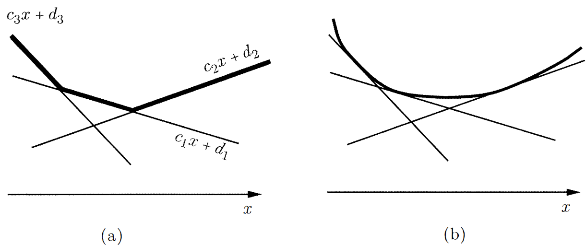

# 第一章 导论

# 线性规划问题的形式

## 一般形式

&emsp;&emsp;我们直接考虑一般形式的线性规划问题。我们给定一个成本向量$\boldsymbol{c}=(c_1,c_2,...,c_n)^\top$，并且我们寻求在所有满足一组线性等式和不等式约束的$n$维向量$\boldsymbol{x}=(x_1,x_2,...,x_n)^\top$上最小化线性成本函数$\boldsymbol{c}^\top\boldsymbol{x}=\sum_{i=1}^nc_ix_i$：

$$
\begin{equation}\notag
\begin{split}
\min\quad&\boldsymbol{c}^\top\boldsymbol{x} \\
\text{s.t.}\quad&\boldsymbol{a}_i^\top\boldsymbol{x}\geq b_i\quad i\in M_1 \\
&\boldsymbol{a}_i^\top\boldsymbol{x}\leq b_i\quad i\in M_2 \\
&\boldsymbol{a}_i^\top\boldsymbol{x}=b_i\quad i\in M_3 \\
& x_j\geq0\quad j\in N_1 \\
&x_j\leq0\quad j\in N_2
\end{split}
\end{equation}
$$

其中，$M_1,M_2,M_3$分别对应不等式或等式约束的有限索引集；第$i$个索引给予一个$n$维向量$\boldsymbol{a}_i$和标量$b_i$，用于表述约束条件；$N_1,N_2\subseteq\{1,2,...,n\}$，指示哪些变量$x_j$被约束为非负或非正。

&emsp;&emsp;上述变量$x_1,x_2,...,x_n$称为**决策变量**(decision variables)；所有满足约束的向量$\boldsymbol{x}$称为**可行解**(feasible solution)或**可行向量**(feasible vector)。如果$j$即不在$N_1$中也不在$N_2$中，则对$x_j$的符号没有限制，在这种情况下，我们称$x_j$是**自由**(free)或者**无限制**(unrestricted)变量。函数$\boldsymbol{c}^\top\boldsymbol{x}$被称为**目标函数**(objective function)或**成本函数**(cost function)。最小化目标函数的可行解$\boldsymbol{x}^*$(即对于所有的可行$\boldsymbol{x}$有$\boldsymbol{c}^\top\boldsymbol{x}^*\leq\boldsymbol{c}^\top\boldsymbol{x}$)称为**最优可行解**(optimal feasible solution)，或简单地说，**最优解**(optimal solution)。$\boldsymbol{c}'\boldsymbol{x}^*$的值称为**最优成本**(optimal cost)。另一方面，对于每个实数$K$，我们都能找到一个可行解$\boldsymbol{x}$，其成本小于$K$，我们称最有成本是$-\infty$或说成本是**无下界的**(unbounded below)，有时我们会滥用术语称这个问题是**无界的**(unbounded)。显然，我们不必单独研究最大化问题，因为最大化$\boldsymbol{c}^\top\boldsymbol{x}$等价于最小化$-\boldsymbol{c}^\top\boldsymbol{x}$。

## 标准形式

&emsp;&emsp;一个线性规划问题的**标准形式**(standard form)如下：

$$
\begin{equation}\notag
\begin{split}
\min\quad&\boldsymbol{c}^\top\boldsymbol{x} \\
\text{s.t.}\quad&A\boldsymbol{x}=\boldsymbol{b} \\
&\boldsymbol{x}\geq\boldsymbol{0}
\end{split}
\end{equation}
$$

&emsp;&emsp;假设$\boldsymbol{x}$是一个$n$维向量，$A$是一个$m\times n$的矩阵。令$\boldsymbol{a}^\top_1,\boldsymbol{a}^\top_2,...,\boldsymbol{a}^\top_m$为$A$的行向量，那么$m$个等式约束就是$\boldsymbol{a}^\top_i\boldsymbol{x}=b_i,i=1,2,...,m$。令$\boldsymbol{A}_1,\boldsymbol{A}_2,...,\boldsymbol{A}_n$表示$A$的列向量，那么约束$A\boldsymbol{x}=\boldsymbol{b}$可以写为：

$$
\sum\limits_{i=1}^n\boldsymbol{A}_ix_i=\boldsymbol{b}
$$

## 化简为标准形式

&emsp;&emsp;实际上，任何线性规划问题，包括标准形式问题都是一般形式问题的特殊情况。现在，我们能够证明反过来也是一样，即一般线性规划问题可以转化为标准形式问题。我们可以用以下方式。

1. **消除自由变量**(Elimination of free variables)

	&emsp;&emsp;一般形式中，给定一个无约束变量$x_j$，我们可以将其替换为$x_j^+-x_j^-$，其中$x_j^+$和$x_j^-$都是新的变量且带有符号约束$x_j^+\geq0,x_j^-\geq0$。其基本思想是，任意实数都可以写成两个非负数之差。但值得注意的是，这样的解存在无穷多个。有时我们添加$x_j^+\cdot x_j^-=0$约束，以实现解的唯一性，但这就不是线性规划问题了。这样的处理，常常用来处理绝对值变量，即$|x_j|=x_j^++x_j^-,x_j^+\cdot x_j^-=0$。

2. **消除不等式约束**(Elimination of inequality constraints)

	&emsp;&emsp;两类不等式约束都可以转化为等式约束：

$$
\begin{align*}
\sum\limits_{j=1}^na_{ij}x_j\leq b_i\quad&\rightarrow\quad\sum\limits_{j=1}^na_{ij}x_j+s_i=b_i,s_i\geq0\quad i\in M_1 \\
\sum\limits_{j=1}^na_{ij}x_j\geq b_i\quad&\rightarrow\quad\sum\limits_{j=1}^na_{ij}x_j-e_i=b_i,e_i\geq0\quad i\in M_2
\end{align*}
$$

&emsp;&emsp;其中，变量$s_i$称为**松弛**(slack)变量，$e_i$称为**剩余**(surplus)变量。

# 分段线性凸目标函数

&emsp;&emsp;之前讨论的问题形式中目标函数都是线性的，然而还有一类非常重要的非线性目标函数的优化问题可以转化为线性规划问题。

!!! note "Definition 1.1 (convex, concave function)"

    * 一个函数$f:\mathbb{R}^n\rightarrow\mathbb{R}$是**凸的**(convex)，是当任意$\boldsymbol{x},\boldsymbol{y}\in\mathbb{R}^n,\lambda\in[0,1]$时，有：

    $$ f(\lambda\boldsymbol{x}+(1-\lambda)\boldsymbol{y})\leq\lambda f(\boldsymbol{x})+(1-\lambda)f(\boldsymbol{y}) $$

    * 一个函数$f:\mathbb{R}^n\rightarrow\mathbb{R}$是**凹的**(concave)，是当任意$\boldsymbol{x},\boldsymbol{y}\in\mathbb{R}^n,\lambda\in[0,1]$时，有：

    $$ f(\lambda\boldsymbol{x}+(1-\lambda)\boldsymbol{y})\geq\lambda f(\boldsymbol{x})+(1-\lambda) f(\boldsymbol{y}) $$

&emsp;&emsp;形式为$f(\boldsymbol{x})=a_0+\sum\limits_{i=1}^na_ix_i$，其中$a_0,a_1,....,a_n$时标量，称为**仿射**(affine)函数。它既是凸的也是凹的。而事实证明，仿射函数是唯一的既凸又凹的函数。如果在$\boldsymbol{x}$附近的$\boldsymbol{y}$都有$f(\boldsymbol{x})\leq f(\boldsymbol{y})$时，我们称向量$\boldsymbol{x}$是$f$的一个**局部极小值**(local minimum)。如果对任意的$\boldsymbol{y}$都有$f(\boldsymbol{x})\leq f(\boldsymbol{y})$，我们称$\boldsymbol{x}$是一个**全局最小值**(global minimum)。一个凸函数不可能有局部极小值而不是全局极小值，这个性质在设计有效的优化算法时有很大的帮助。

&emsp;&emsp;令$\boldsymbol{c}_1,\boldsymbol{c}_2,...,\boldsymbol{c}_m$是$\mathbb{R}^n$中的向量，$d_1,d_2,...,d_m$是标量，考虑这样一个函数$f:\mathbb{R}^n\rightarrow\mathbb{R}$定义为：

$$
f(\boldsymbol{x})=\max\limits_{i=1,2,...,m}(\boldsymbol{c}^\top_i\boldsymbol{x}+d_i)
$$

&emsp;&emsp;这是一个凸函数，有以下结论。

!!! danger "Theorem 1.1"

    &emsp;&emsp;令$f_1,f_2,...,f_m:\mathbb{R}^n\rightarrow\mathbb{R}$是凸函数。那么由$f(\boldsymbol{x})=\max\limits_{i=1,2,...,m}f_i(\boldsymbol{x})$定义的函数$f$也是凸的。

!!! quote "Proof"

    &emsp;&emsp;令$\boldsymbol{x},\boldsymbol{y}\in\mathbb{R}^n$，$\lambda\in[0,1]$，则：
    
    $$
    \begin{align*}
    f(\lambda\boldsymbol{x}+(1-\lambda)\boldsymbol{y})=&\max\limits_{i=1,2,...,m}f_i(\lambda\boldsymbol{x}+(1-\lambda)\boldsymbol{y}) \\
    \leq&\max\limits_{i=1,2,...,m}(\lambda f_i(\boldsymbol{x})+(1-\lambda)f_i(\boldsymbol{y})) \\
    \leq&\max\limits_{i=1,2,...,m}\lambda f_i(\boldsymbol{x})+\max\limits_{i=1,2,...,m}(1-\lambda)f_i(\boldsymbol{y}) \\
    =&\lambda f(\boldsymbol{x})+(1-\lambda)f(\boldsymbol{y})
    \end{align*}
    $$

&emsp;&emsp;一个函数形式为$\max\limits_{i=1,2,...,m}(\boldsymbol{c}_i^\top\boldsymbol{x}+d_i)$被称为**分段线性凸**(piecewise linear convex)函数。一个最简单的例子便是绝对值函数$f(x)=|x|=\max\{x,-x\}$。如下图1.1所示，分段线性凸函数可以用于近似一般凸函数。

{ width="600" }
/// caption
图1.1 分段线性凸函数与其近似
///

&emsp;&emsp;注意到$\max\limits_{i=1,2,...,m}(\boldsymbol{c}_i^\top\boldsymbol{x}+d_i)$实际上是等价于找到满足$z\geq\boldsymbol{c}_i^\top\boldsymbol{x}+d_i,\forall i$最小的$z$。有了这个观察，上述分段线性凸目标函数问题可以等价于下面这个线性规划问题：

$$
\begin{align*}
\min\quad&z \\
\text{s.t.}\quad&z\geq\boldsymbol{c}_i^\top\boldsymbol{x}+d_i\quad i=1,2,...,m \\
&A\boldsymbol{x}\geq\boldsymbol{b}
\end{align*}
$$

其中的决策变量为$z$和$\boldsymbol{x}$。

&emsp;&emsp;总之，线性规划可以用来解决分段线性凸代价函数的问题，而后一类函数可以作为更一般的凸代价函数的近似。另一方面，这样的分段线性近似并不总是一个好主意，因为它会把光滑函数变成非光滑函数(分段线性函数有不连续的导数)。

&emsp;&emsp;最后，我们注意到，如果给定一个形式为$f(\boldsymbol{x})\leq h$，其中$f$是分段线性凸函数$f(\boldsymbol{x})=\max\limits_{i=1,2,...,m}(\boldsymbol{f}_i^\top\boldsymbol{x}+g_i)$，这样的约束我们可以重写为：

$$
\boldsymbol{f}_i^\top\boldsymbol{x}+g_i\leq h\quad i=1,2,...,m
$$

&emsp;&emsp;带有绝对值变量的目标函数的规划问题就是其典型应用。

$$
\begin{align*}
\min\quad&\sum\limits_{i=1}^nc_i|x_i| \\
\text{s.t.}\quad&A\boldsymbol{x}\geq\boldsymbol{b}
\end{align*}
$$

其中，$\boldsymbol{x}=(x_1,x_2,...,x_n)$，并且假设成本系数$c_i$是非负的。很容易验证此目标函数是分段线性凸函数。我们观察到$|x_i|$是满足$x_i\leq z_i$和$-x_i\leq z_i$的最小的$z_i$，所以我们可以得到此问题的线性规划形式：

$$
\begin{align*}
\min\quad&\sum\limits_{i=1}^nc_iz_i \\
\text{s.t.}\quad&A\boldsymbol{x}\geq\boldsymbol{b} \\
&x_i\leq z_i\quad i=1,2,...,n \\
&-x_i\leq z_i\quad i=1,2,...,n
\end{align*}
$$

# 图形表示于求解

-   !!! example "Example 1.1"

        &emsp;&emsp;我们以一个二维的例子，来初步理解线性规划的图形：

        $$
        \begin{align*}
        \min\quad&-x_1-x_2 \\
        \text{s.t.}\quad&x_1+2x_2\leq3 \\
        &2x_1+x_2\leq3 \\
        &x_1,x_2\geq0
        \end{align*}
        $$

        &emsp;&emsp;这个问题的可行集是右图1.2的阴影区域。观察有哪些特征。
    
-   <figure markdown="span">
    { width="300" }
    <figcaption>图 1.2 线性规划二维视图的例子</figcaption>
    </figure>

!!! tip "Solution"

    &emsp;&emsp;为了找到最佳解，我们进行如下操作。对于任意给定的标量$z$，我们考虑成本$\boldsymbol{c}'\boldsymbol{x}$等于$z$的所有点的集合。

    &emsp;&emsp;注意到这条直线是垂直于向量$\boldsymbol{c}=(-1,-1)$，不同$z$值导致不同的线，它们都彼此平行。特别地，而$\boldsymbol{c}$所指方向是$z=-x_1-x_2$使$z$值增加的方向。所以，我们希望尽可能沿着$-\boldsymbol{c}$的方向移动直线，直到可行集的边缘。

    &emsp;&emsp;我们考虑标准形式的问题，矩阵$A$的维度为$m\times n$，决策向量$\boldsymbol{x}$的维度为$n$。不妨假设$m\leq n$并且约束$A\boldsymbol{x}=\boldsymbol{b}$迫使$\boldsymbol{x}$位于$(n-m)$维的集合上。因为在$A$中可以任选择$m$列，构成$m\times m$的方阵，这部分可以得到唯一解；而剩余的$(n-m)$维就是$\boldsymbol{x}$灵活的部分，构成可行集的一部分。注意到这$m$列是任选的，所以还有${n}\choose{m}$种固定方式。

# 基础知识

> 这一节提供了我们将使用的主要记法惯例的总结，它还包含了对线性代数的结果的简要回顾，这些结果将在续集中使用。这一章节建议具体学习[《Linear Algebra Done Right》](../../Part3/LinearAlgebra/index.md)，以下只介绍线性规划中可能使用到的定义和结论。

## 向量

&emsp;&emsp;如果$\boldsymbol{x}$和$\boldsymbol{y}$是$\mathbb{R}^n$中的向量，那么：

$$
\boldsymbol{x}^\top\boldsymbol{y}=\boldsymbol{y}^\top\boldsymbol{x}=\sum\limits_{i=1}^nx_iy_i
$$

&emsp;&emsp;上式表示$\boldsymbol{x}$与$\boldsymbol{y}$的**内积**(inner product)；如果两个向量的内积为$0$，则它们**正交**(orthogonal)。

&emsp;&emsp;注意，对于每个向量$\boldsymbol{x}$，如果$\boldsymbol{x}^\top\boldsymbol{x}\geq0$，当且仅当$\boldsymbol{x}=0$。表达式$\sqrt{\boldsymbol{x}^\top\boldsymbol{x}}$是$\boldsymbol{x}$的**欧几里得范数**(Euclidean norm)，记为$\Vert\boldsymbol{x}\Vert$。**Schwartz不等式**(Schwartz inequality)断言，对于任何两个相同维度的向量，我们有：

$$
|\boldsymbol{x}'\boldsymbol{y}|\leq\Vert\boldsymbol{x}\Vert\cdot\Vert\boldsymbol{y}\Vert
$$

&emsp;&emsp;当且仅当两个向量中的一个是另一个标量倍数时等式成立。

&emsp;&emsp;如果$\boldsymbol{x}$是一个向量，符号$\boldsymbol{x}\geq0$表示$\boldsymbol{x}$中的每个元素都是非负的，$\boldsymbol{x}>0$表示$\boldsymbol{x}$中每个分量都是正的。矩阵也是同理。

## 矩阵

&emsp;&emsp;矩阵的逆在线性规划中有着重要的意义，令$A$是一个方阵。如果存在一个相同维数的方阵$B$满足$AB=BA=I$，我们称$A$是**可逆的**(invertible)或**非奇异的**(nonsingular)。这样的矩阵$B$称为$A$的**逆**(inverse)矩阵，它是唯一的。

&emsp;&emsp;给定有限个向量$\boldsymbol{x}_1,\boldsymbol{x}_2,...,\boldsymbol{x}_K$，如果存在实数$a_1,a_2,...,a_K$，不全为$0$，使得$\sum\limits_{k=1}^Ka_k\boldsymbol{x}_k=\boldsymbol{0}$，则称它们**线性相关**(linearly dependent)，否则称为**线性无关**(linearly independent)。我们还有如下结果：

!!! danger "Theorem 1.2"

    &emsp;&emsp;令$\boldsymbol{A}$是一个方阵，那么下面的声明是等价的：

    * $\boldsymbol{A}$是可逆的。
    * $\boldsymbol{A}^\top$是可逆的。
    * $\boldsymbol{A}$的行列式的值非零。
    * $\boldsymbol{A}$的行向量是线性无关的。
    * $\boldsymbol{A}$的列向量是线性无关的。
    * 对于任意的向量$\boldsymbol{b}$，线性系统$\boldsymbol{A}\boldsymbol{x}=\boldsymbol{b}$有唯一解。
    * 存在向量$\boldsymbol{b}$使得线性系统$\boldsymbol{A}\boldsymbol{x}=\boldsymbol{b}$有唯一解。

## 子空间与基

&emsp;&emsp;如果任意的$\boldsymbol{x},\boldsymbol{y}\in S$和任意的$a,b\in\mathbb{R}$，都有$a\boldsymbol{x}+b\boldsymbol{y}\in S$，$\mathbb{R}^n$的非空子集$S$称为$\mathbb{R}^n$的**子空间**(subspace)。此外，如果$S\neq\mathbb{R}^n$，我们称$S$是一个**真**(proper)子空间。注意，每个子空间必须包含零向量。

&emsp;&emsp;在$\mathbb{R}^n$中，有限数量的向量$\boldsymbol{x}_1,\boldsymbol{x}_2,...,\boldsymbol{x}_K$的**张成**(span)是$\mathbb{R}^n$的子空间，其空间中的元素可以表示为$\boldsymbol{y}=\sum\limits_{k=1}^Ka_k\boldsymbol{x}_K$，其中每个$a_k$都是一个实数。任意的$\boldsymbol{y}$称为$\boldsymbol{x}_1,\boldsymbol{x}_2,...,\boldsymbol{x}_K$的一个**线性组合**(linear combination)。

&emsp;&emsp;给定$\mathbb{R}^n$的一个子空间$S$且$S\neq\{0\}$，$S$的**基**(basis)是一组线性独立的向量，其张成等于$S$。给定子空间的基都有相同数量的向量，这个数量称为子空间的**维数**(dimension)。特别的，$\mathbb{R}^n$的维数就是$n$，它的真子空间的维数都小于$n$。最后，集合$\{\boldsymbol{0}\}$是一个子空间，它的维数为$0$。如果$S$是$\mathbb{R}^n$的一个真子空间，那么存在一个非零向量$\boldsymbol{a}$正交于$S$，即$\forall \boldsymbol{x}\in S,\boldsymbol{a}^\top\boldsymbol{x}=0$。更一般地说，如果$S$是$m<n$维的，那么存在$n-m$个线性独立的向量正交于$S$。以下结果说明了基和线性独立的重要性。

!!! example "Example 1.2"

    &emsp;&emsp;为增强理解，这里举一个三维空间$\mathbb{R}^3$的例子，来直观感受线性独立、正交、基、张成和子空间。

!!! tip "Solution"

    &emsp;&emsp;三维空间中的三个坐标轴$\boldsymbol{x}=(1,0,0)^\top,\boldsymbol{y}=(0,1,0)^\top,\boldsymbol{z}=(0,0,1)^\top$。它们都是相互垂直的，也就是相互<u>正交</u>的，即$\boldsymbol{x}^\top\boldsymbol{y}=\boldsymbol{y}^\top\boldsymbol{z}=\boldsymbol{x}^\top\boldsymbol{z}=0$。显然，它们都是<u>线性独立</u>的，其中任意一个向量，都无法由其它两个向量的线性组合表示出来。

	&emsp;&emsp;三维空间中任意一个向量都能有由它们的线性组合表示出来，因此它们是$\mathbb{R}^3$的一组<u>基</u>，即$\forall \boldsymbol{w}\in\mathbb{R}^3,\boldsymbol{w}=a\boldsymbol{x}+b\boldsymbol{y}+c\boldsymbol{z},a,b,c\in\mathbb{R}$。$\mathbb{R}^3$的基是一定能<u>张成</u>​$\mathbb{R}^3$的；再取任意一个或多个$\mathbb{R}^3$中的元素，都能与基$\boldsymbol{x},\boldsymbol{y},\boldsymbol{z}$张成空间$\mathbb{R}^3$。但$\mathbb{R}^3$的基不是唯一的，比如，把$\boldsymbol{z}$进行旋转、拉伸，只要无法被$\boldsymbol{x},\boldsymbol{y}$线性表示i出来，$\boldsymbol{x},\boldsymbol{y},\boldsymbol{z}$依旧都是$\mathbb{R}^3$的一组基。

	&emsp;&emsp;线$\mathbb{R}$和面$\mathbb{R}^2$都是三维空间$\mathbb{R}^3$中的<u>真子空间</u>，它们的维数分别为$1$和$2$。对于二维空间$\mathbb{R}^2$，它能找到一条线，正交于这个二维空间。比如，由$\boldsymbol{x},\boldsymbol{y}$张成的二维空间，那么第三条坐标轴$\boldsymbol{z}$正交于这个二维空间。对于一维空间$\mathbb{R}$，可以找到一个面，面上的任意一条线都正交于这条线，而这条线作为一维空间，有$1=3-2$个独立向量。比如，$\boldsymbol{z}$轴就是一个一维空间，那么由$\boldsymbol{x},\boldsymbol{z}$张成的二维空间中的任意一个向量都正交于$\boldsymbol{z}$。而这个二维空间有$2=3-1$个独立向量。

!!! danger "Theorem 1.2"

    &emsp;&emsp;设由$\boldsymbol{x}_1,\boldsymbol{x}_2,...,\boldsymbol{x}_K$张成的空间$S$是$m$维的。则：

    * $\boldsymbol{x}_1,\boldsymbol{x}_2,...,\boldsymbol{x}_K$中存在$m$个向量组成$S$的一组基。
    * 如果$k\leq m$且$\boldsymbol{x}_1,\boldsymbol{x}_2,...,\boldsymbol{x}_k$是线性独立的，可在$\boldsymbol{x}_{k+1},\boldsymbol{x}_{k+2},...,\boldsymbol{x}_K$中找出$m-k$个向量与$\boldsymbol{x}_1,\boldsymbol{x}_2,...,\boldsymbol{x}_k$组成$S$的一组基。

&emsp;&emsp;令$A$是一个维度为$m\times n$的矩阵，则$A$的**列空间**(column space)是由$A$的$m$个列向量张成的属于$\mathbb{R}^m$的子空间，$A$的**行空间**(row space)是由$A$的$n$个行向量张成的属于$\mathbb{R}^n$的子空间。列空间的维度总是等于行空间的维度，这样数字称为$A$的**秩**(rank)，表示为$\mathrm{rank}(A)$。显然，$\mathrm{rank}(A)\leq\min\{m,n\}$。如果$\mathrm{rank}(A)=\min\{m,n\}$，则称矩阵$A$是**满秩的**(full rank)。最后，集合$\{\boldsymbol{x}\in\mathbb{R}^n|A\boldsymbol{x}=\boldsymbol{0}\}$称为$A$的**零空间**(nullspace)，它是$\mathbb{R}^n$的子空间，其维度等于$n-\mathrm{rank}(A)$。

## 仿射子空间

&emsp;&emsp;令$S_0$是$\mathbb{R}^n$的一个子空间，$\boldsymbol{x}_0$是某个向量。如果我们将$\boldsymbol{x}_0$加到$S_0$的每个元素上，这种操作及其结果集合我们定义为：

$$
S=S_0+\boldsymbol{x}_0=\{\boldsymbol{x}+\boldsymbol{x}_0:\boldsymbol{x}\in S_0\}
$$

&emsp;&emsp;一般来说$S$不是一个子空间，因为它不一定包含零向量，它被称为**仿射空间**(affine subspace)。$S$的维度被定义为其基础子空间$S_0$的维度。

!!! example "Example 1.3"

    &emsp;&emsp;以下例子可以帮助我们理解仿射空间。

    1. 令$\boldsymbol{x}_0,\boldsymbol{x}_1,...,\boldsymbol{x}_k$是$\mathbb{R}^n$中的一些向量，考虑这样的$S$集合：

        $$
        \boldsymbol{x}_0+\lambda_1\boldsymbol{x}_1+\lambda_2\boldsymbol{x}_2+...+\lambda_k\boldsymbol{x}_k
        $$

        其中$\lambda_1,\lambda_2,...,\lambda_k$是任意的常量。

        &emsp;&emsp;如果$S_0$由$\boldsymbol{x}_1,\boldsymbol{x}_2,...,\boldsymbol{x}_k$张成，则$S$是一个仿射空间。特别地，如果$\boldsymbol{x}_1,\boldsymbol{x}_2,...,\boldsymbol{x}_k$线性独立，则$S$的维数为$k$。

    2. 给定一个$m\times n$的矩阵$A$和一个$m$维的向量$\boldsymbol{b}$，考虑这样的集合：

        $$
        S=\{\boldsymbol{x}\in\mathbb{R}^n:A\boldsymbol{x}=\boldsymbol{b}\}
        $$

        &emsp;&emsp;假设这个集合不为空。

        &emsp;&emsp;我们可以找到一个向量$\boldsymbol{x}_0$使得$A\boldsymbol{x}_0=\boldsymbol{b}$，那么$S$中的元素$\boldsymbol{x}$一定满足$A\boldsymbol{x}=A\boldsymbol{x}_0=\boldsymbol{b}$，说明$A(\boldsymbol{x}-\boldsymbol{x}_0)=\boldsymbol{0}$。因此，若$\boldsymbol{x}\in S$当且仅当$\boldsymbol{x}-\boldsymbol{x}_0\in S_0=\{\boldsymbol{y}:A\boldsymbol{y}=\boldsymbol{0}\}$，也即$A$的零空间。我们得出结论，$S=\{\boldsymbol{y}+\boldsymbol{x}_0:\boldsymbol{y}\in S_0\}$，并且$S$是$\mathbb{R}^n$的一个仿射子空间。如果$A$有$m$个线性独立的行向量，则其零空间的维数为$n-m$。因此仿射子空间$S$的维数也为$n-m$。

        &emsp;&emsp;直觉上，$\boldsymbol{a}_i^\top\boldsymbol{x}=0$代表着$A$的零空间第$i$个维度是自由的，当$\boldsymbol{a}_i^\top\boldsymbol{x}=b_i$这个自由维度就固定了，因此新的空间就减少了一个维度。当$\boldsymbol{b}$有$m$维，那么新的空间就会减少$m$维，也就剩余$n-m$维。

# 算法复杂度

&emsp;&emsp;优化问题一般都是通过**算法**(algorithm)解决的。这一节，我们将大致比较不同算法的复杂度。

!!! note "Definition 1.2"

    &emsp;&emsp;令$f$和$g$都是正数映射到正数的函数：

    * 如果存在正数$n_0$和$c$使得$f(n)\leq cg(n),\forall n\geq n_0$，我们写为$f(n)=O(g(n))$。
    * 如果存在正数$n_0$和$c$使得$f(n)\geq cg(n),\forall n\geq n_0$，我们写为$f(n)=\Omega(g(n))$。
    * 如果$f(n)=O(g(n))$且$f(n)=\Omega(g(n))$，则写为$f(n)=\Theta(g(n))$。

&emsp;&emsp;比如$3n^3+n^2+10=\Theta(n^3),n\log n=O(n^2),n\log n=\Omega(n)$。如果一个程序的执行时间能够表示为$O(n^k)$，我们称这种任务能在**多项式时间**(polynomial time)范围内运行。而一个程序的执行时间是$\Omega(2^{cn})$，其中$c$是常数，随着$c$增加，执行时间称指数增长，我们称它至少花费**指数级时间**(exponential time)。

&emsp;&emsp;最后，我们简单理解这个$n$是什么，它代表了问题的规模。比如一个排序问题，我们要对$n$个数字进行排序，这个问题的$n$是不确定的，但具体的问题中它是确定的。而排序问题在目前最好的算法，要花费的时间为$O(n\log n)$。简单一点，我们有$n$个元素，我们把这$n$个元素数一遍(也可能指$n$次简单计算)，这个时间为$n$；我们要求对$n$个元素数两遍，那么这个时间就为$2n$。
