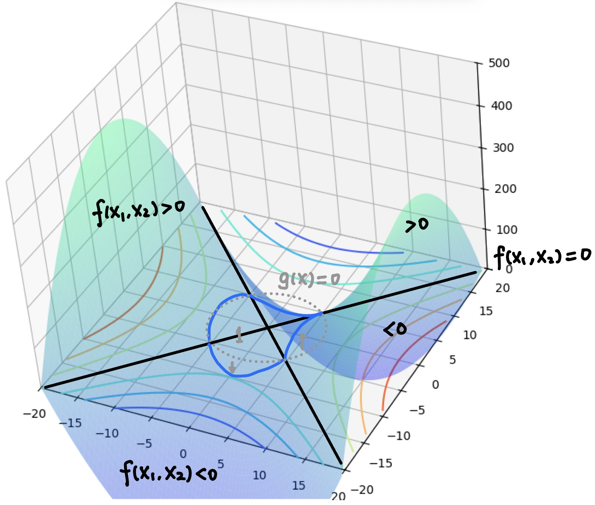

# 拉格朗日乘子法

&emsp;&emsp;拉格朗日乘子(Lagrange Multipliers)法[^1]是一种寻找多元函数在一组**等式**约束下的极值方法。通过引入拉格朗日乘子，可将有$n$个变量与$m$个约束条件的最优化问题转化为具有$n+m$个变量的无约束优化问题求解。

&emsp;&emsp;先考虑一个等式约束的优化问题。

&emsp;&emsp;对于具有一个等式约束的优化问题，可形式化地描述为：给定一个目标函数$f:\mathbb{R}^n\rightarrow\mathbb{R}$，我们希望找到$\boldsymbol{x}\in\mathbb{R}^n$，在满足约束条件$g(\boldsymbol{x})=0$的前提下，使得$f(\boldsymbol{x})$有最小值。这个优化问题记为：

$$
\begin{align}
	\min\quad&f(\boldsymbol{x})\label{f:obj}\tag{1}\\
	\text{s.t.}\quad&g(\boldsymbol{x})=0\label{f:eq-constrain}\tag{2}
\end{align}
$$

从几何角度看，该问题的目标是在由方程$g(\boldsymbol{x})=0$确定的$n-1$维平面上寻找能使目标函数$f(\boldsymbol{x})$最小化的点。此时不难得到如下结论：

<figure markdown="span">
  { width="300" }
  <figcaption>图 (1). 等值线示例</figcaption>
</figure>

{ width="250" }
/// caption
图 (2). $g(\boldsymbol{x})$与梯度的理解
///

* 对于约束曲面上的任意点$\boldsymbol{x}$，该点的梯度$\nabla g(\boldsymbol{x})$正交于约束曲面。
	
	正如图(1)所示，$g(\boldsymbol{x})=0$实际上是函数$g(\boldsymbol{x})$的一条等值线。而$g(\boldsymbol{x})$的梯度$\nabla g(\boldsymbol{x})$一定是正交(垂直)于经过$\boldsymbol{x}$的等值线的。
	
* 在最优点$\boldsymbol{x}^*$，目标函数在该点的梯度$\nabla f(\boldsymbol{x}^*)$正交于约束曲面。
	
    我们可以通过反证法说明：如果$f(\boldsymbol{x})$在$\boldsymbol{x}^*$的梯度$\nabla f(\boldsymbol{x}^*)$与约束平面不正交，那么可以找到$\nabla f(\boldsymbol{x}^*)$的一个分量，使其在$g(\boldsymbol{x})$移动一段距离且使得$f(\boldsymbol{x}^*)$下降。这与$\boldsymbol{x}^*$是最优值矛盾。

&emsp;&emsp;由此可知，在最优点$\boldsymbol{x}^*$，梯度$\nabla g(\boldsymbol{x})$和$\nabla f(\boldsymbol{x})$的方向必相同或者相反，即存在$\lambda\neq0$使得：

$$
\begin{equation}\tag{3}
	\label{f:lagrange-constrain-1}
	\nabla f(\boldsymbol{x}^*)+\lambda\nabla g(\boldsymbol{x}^*)=0
\end{equation}
$$

其中，$\lambda$称为拉格朗日乘子。上式($\ref{f:lagrange-constrain-1}$)也被称为**定常方程式**(stationary equation)。

&emsp;&emsp;定义拉格朗日(Lagrangian)函数：

$$
\begin{equation}\tag{4}
	\label{f:lagrange}
	L(\boldsymbol{x},\lambda)=f(\boldsymbol{x})+\lambda g(\boldsymbol{x})
\end{equation}
$$

&emsp;&emsp;不难发现，将($\ref{f:lagrange}$)对$\boldsymbol{x}$求偏导后置零，$\frac{\partial L(\boldsymbol{x},\lambda)}{\partial\boldsymbol{x}}=0$，就能得到上式($\ref{f:lagrange-constrain-1}$)。同时，将其对$\lambda$求偏导数置零，$\frac{\partial L(\boldsymbol{x},\lambda)}{\partial\lambda}=0$，就能得到等式约束条件($\ref{f:eq-constrain}$)。于是，我们就将原约束优化问腿转化为了无约束优化问题：

$$
\begin{equation}\notag
	\min\limits_{\boldsymbol{x},\lambda}\quad L(\boldsymbol{x},\lambda)=f(\boldsymbol{x})+\lambda g(\boldsymbol{x})
\end{equation}
$$

&emsp;&emsp;我们可以将上述问题扩展为多个等式约束的优化问题：

$$
\begin{equation}\notag
	\begin{split}
		\min\quad&f(\boldsymbol{x})\\
		\text{s.t.}\quad&g_i(\boldsymbol{x})=0
	\end{split}
\end{equation}
$$

&emsp;&emsp;同样的道理，我们可以找到一系列的拉格朗日乘子$\boldsymbol{\lambda}=(\lambda_1,\lambda_2,...,\lambda_m)$，定义其拉格朗日函数：

$$
\begin{equation}\notag
	L(\boldsymbol{x},\boldsymbol{\lambda})=f(\boldsymbol{x})+\sum\limits_{i=1}^m\lambda_ig_i(\boldsymbol{x})
\end{equation}
$$

&emsp;&emsp;其极值的**必要条件**如下：

$$
\begin{align*}
	\nabla_{\boldsymbol{x}}L=&\nabla f+\sum\limits_{i=1}^m\lambda_i\nabla g_i=0 \\
	\nabla_{\lambda_i}L=&g_i(\boldsymbol{x})=0\quad i=1,2,...,m
\end{align*}
$$

&emsp;&emsp;那么，求解上述$n+m$个方程即可得到$L(\boldsymbol{x},\boldsymbol{\lambda})$的**驻点**(stationary point)$\boldsymbol{x}^*$以及$\boldsymbol{\lambda}$的值。

!!! example "考虑下面这个最优化问题[^2]的最值点"
	$$
	\begin{align*}
		\min\quad&x_1^2-x_2^2\\
		\text{s.t.}\quad&x_1^2+x_2^2=1
	\end{align*}
	$$

	其中$(x_1,x_2)\in\mathbb{R}^n$。

{width="300"}
/// caption
图 (3). 示例函数
///

!!! quote "Solution"
	&emsp;&emsp;该问题是一个等式约束问题，先使用拉格朗日乘子法找出驻点，写出拉格朗日函数：

	$$L(x_1,x_2,\lambda)=x_1^2-x_2^2+\lambda(x_1^2+x_2^2-1) $$

	其中$\lambda$为拉格朗日乘子。

	&emsp;&emsp;极值的必要条件如下：

	$$
	\begin{align*}
	\frac{\partial L}{\partial x_1}=&2x_1+2\lambda x_1=0\Rightarrow (1+\lambda)x_1=0\\
	\frac{\partial L}{\partial x_2}=&-2x_2+2\lambda x_2=0\Rightarrow (\lambda-1)x_2=0\\
	\frac{\partial L}{\partial\lambda}=&x_1^2+x_2^2-1=0\Rightarrow x_1^2+x_2^2=1
	\end{align*}
	$$

	&emsp;&emsp;求解上述方程：

	* 若$\lambda=-1$，可得$x_2=0,x_1=\pm1$，则驻点为$(1,0),(-1,0)$。
	* 若$x_1=0$，可得$x_2=\pm1,\lambda=1$，则驻点有$(0,1),(0,-1)$。

	&emsp;&emsp;经过验证，只有$(0,1),(0,-1)$为最小值点，最小值为$-1$。

[^1]: 周志华. 机器学习[M]. 北京: 清华大学出版社, 2016.

[^2]: 周志成. Lagrange 乘數法[EB/OL] [2025-5-8]. https://ccjou.wordpress.com/2012/05/30/lagrange-乘數法/